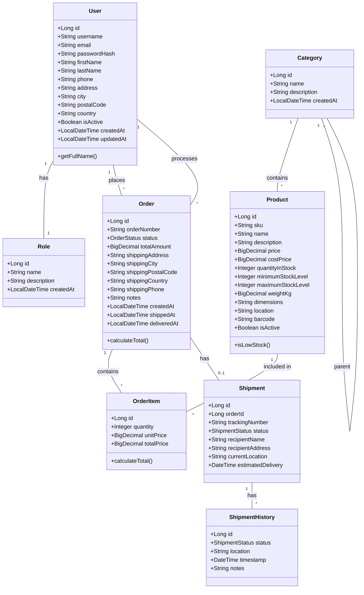
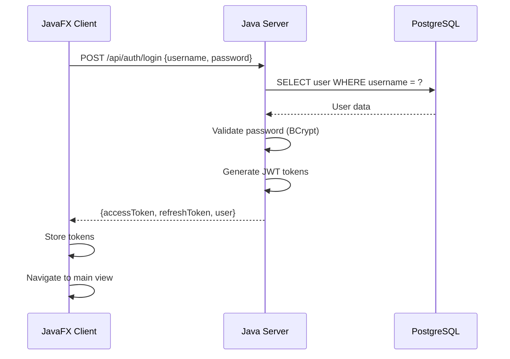
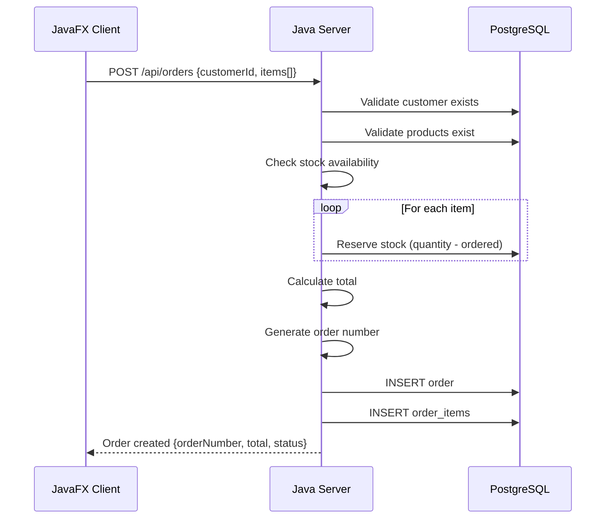
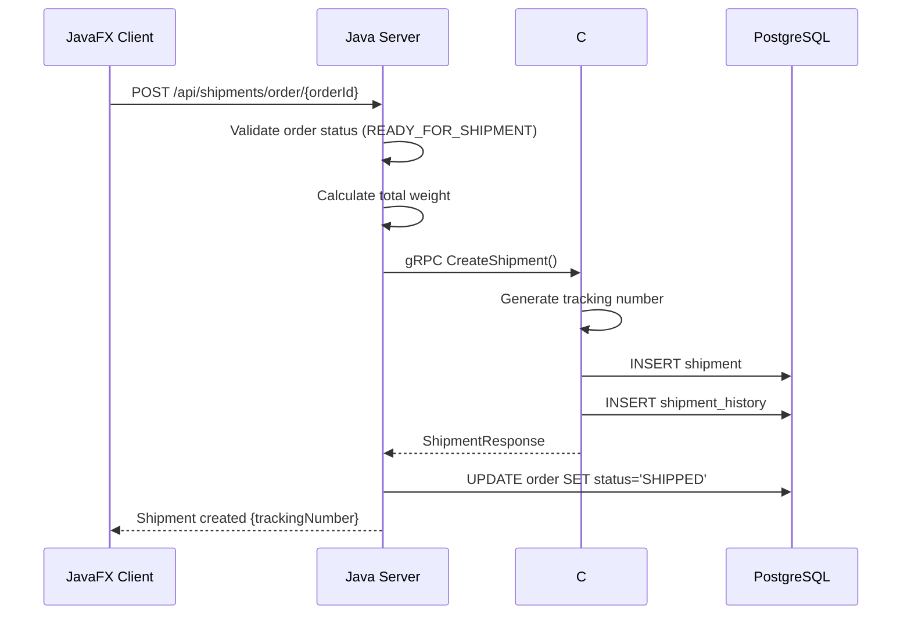
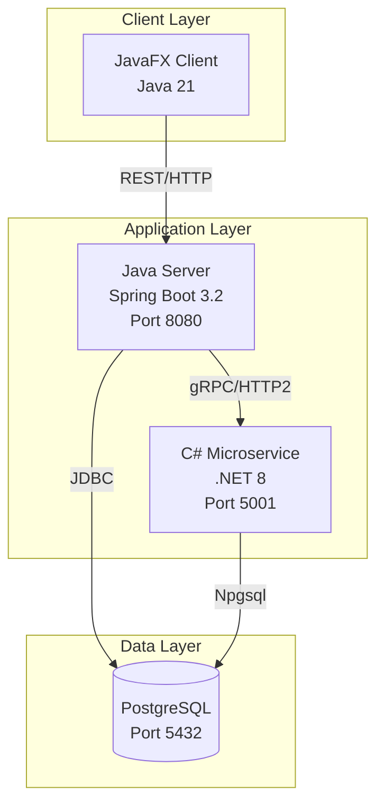
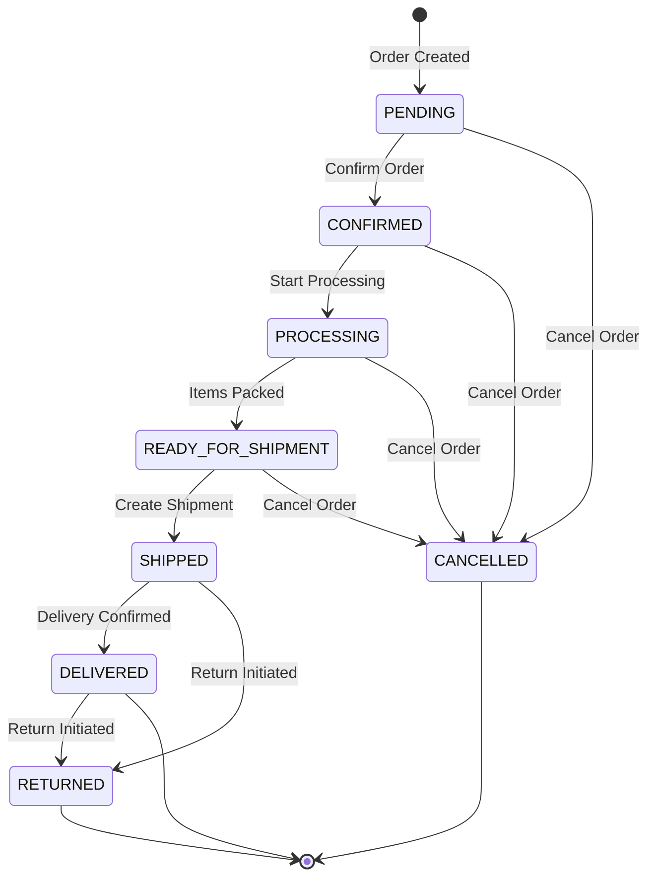
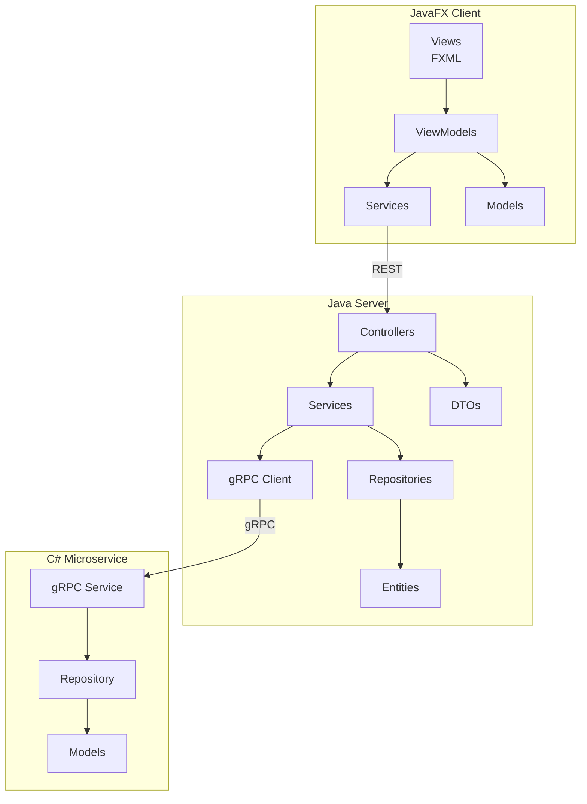

# UML Diagrams

## Warehouse Management System

This directory contains UML diagrams for the SEP3 project.

---

## 1. Use Case Diagram

```mermaid
graph TB
    subgraph Actors
        Admin((Admin))
        Supervisor((Supervisor))
        Operator((Warehouse<br/>Operator))
        Customer((Customer))
    end
    
    subgraph "Authentication"
        UC1[Login]
        UC2[Logout]
        UC3[Register]
    end
    
    subgraph "Inventory Management"
        UC4[View Products]
        UC5[Add Product]
        UC6[Edit Product]
        UC7[Delete Product]
        UC8[Update Stock]
        UC9[View Low Stock]
    end
    
    subgraph "Order Management"
        UC10[View Orders]
        UC11[Create Order]
        UC12[Process Order]
        UC13[Update Order Status]
        UC14[Cancel Order]
    end
    
    subgraph "Shipment Management"
        UC15[Create Shipment]
        UC16[Track Shipment]
        UC17[Update Shipment]
    end
    
    Admin --> UC1
    Admin --> UC2
    Admin --> UC4
    Admin --> UC5
    Admin --> UC6
    Admin --> UC7
    Admin --> UC8
    Admin --> UC9
    Admin --> UC10
    Admin --> UC12
    Admin --> UC13
    Admin --> UC14
    Admin --> UC15
    Admin --> UC16
    Admin --> UC17
    
    Supervisor --> UC1
    Supervisor --> UC2
    Supervisor --> UC4
    Supervisor --> UC5
    Supervisor --> UC6
    Supervisor --> UC8
    Supervisor --> UC9
    Supervisor --> UC10
    Supervisor --> UC12
    Supervisor --> UC13
    Supervisor --> UC14
    Supervisor --> UC15
    Supervisor --> UC16
    
    Operator --> UC1
    Operator --> UC2
    Operator --> UC4
    Operator --> UC5
    Operator --> UC6
    Operator --> UC8
    Operator --> UC9
    Operator --> UC10
    Operator --> UC12
    Operator --> UC13
    Operator --> UC15
    Operator --> UC16
    
    Customer --> UC1
    Customer --> UC2
    Customer --> UC3
    Customer --> UC4
    Customer --> UC11
    Customer --> UC10
    Customer --> UC16
```

---

## 2. Domain Model (Class Diagram)

---

## 3. Sequence Diagram - User Login

---

## 4. Sequence Diagram - Create Order

---

## 5. Sequence Diagram - Process Shipment

---

## 6. Deployment Diagram

---

## 7. Activity Diagram - Order Processing

---

## 8. Component Diagram

---

## Notes

- Diagrams created using Mermaid syntax
- Can be rendered in GitHub, VS Code, or online Mermaid editors
- For Astah exports, create separate .asta files
- Export diagrams as PNG/PDF for documentation
